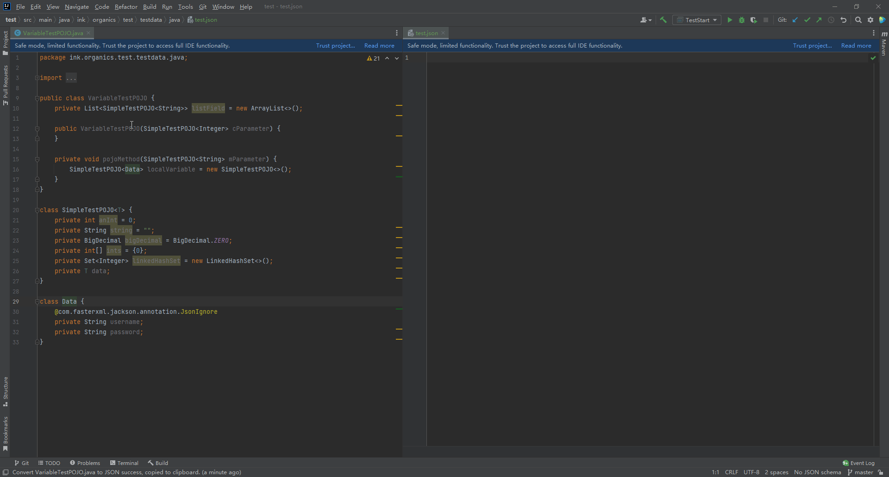
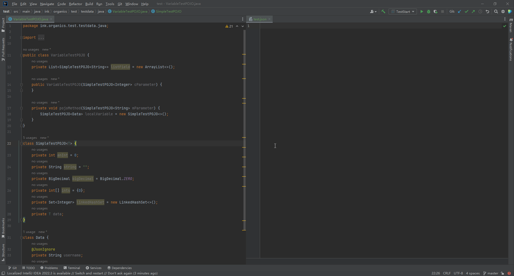
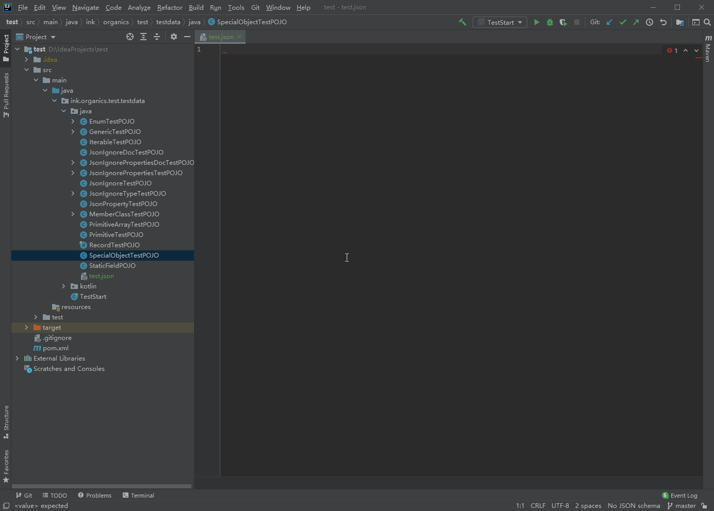
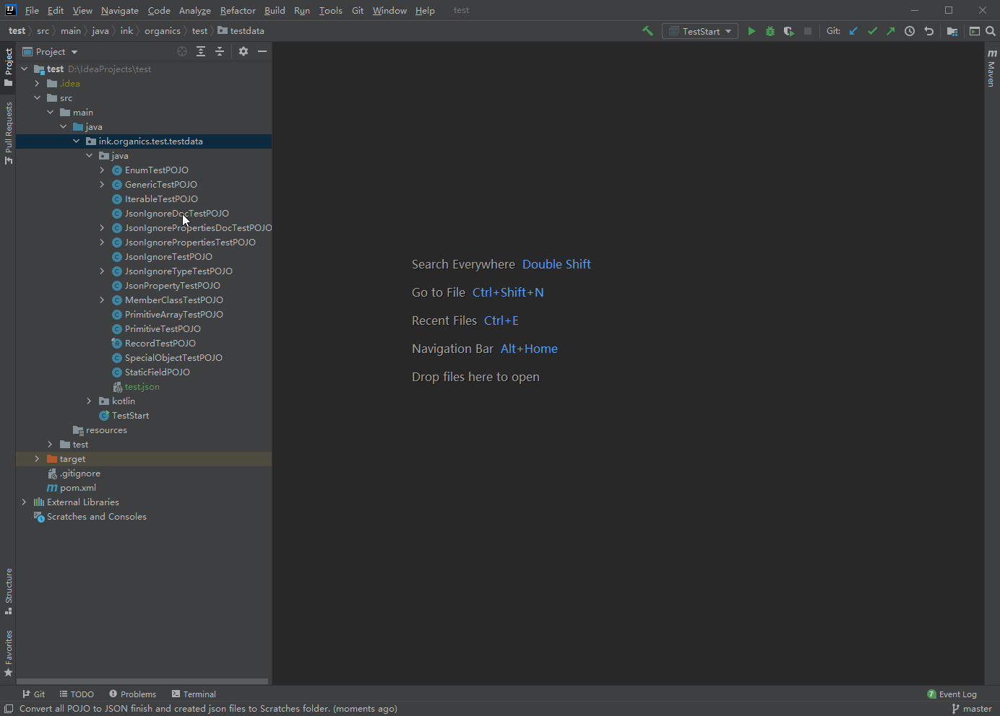

# easy-pojo2json

面向 IntelliJ IDEA 的 POJO 转 JSON 插件。当前仓库已从成熟项目 `pojo2json` 迁移融合，插件 ID 与 Java 包名统一调整为 `com.augustlee.tool.easypojo2json`。

<!-- Plugin description -->

## Easy POJO to JSON

Easy POJO to JSON 是一个用于在 IntelliJ IDEA 中快速把 Java/Kotlin POJO 转换为 JSON 的插件。

核心能力：

- 支持 Java 常见类型、集合、数组、枚举、内部类、泛型等 POJO 结构。
- 支持 Java 17 及 Java 14 Records。
- 支持 Kotlin POJO 转换。
- 部分支持 Jackson、Fastjson 注解。
- 支持从类、成员变量、局部变量、构造参数、方法参数生成 JSON。
- 支持右键菜单、Generate 菜单、项目视图批量转换。
- 支持通过 SpEL 配置字段名与类型默认值生成规则。

<!-- Plugin description end -->

## 项目约定

- 插件 ID：`com.augustlee.tool.easypojo2json`
- 主源码包：`com.augustlee.tool.easypojo2json`
- Gradle root project：`easy-pojo2json`
- Java 版本：17
- IntelliJ Platform：2023.3 起

## 使用方式

1. 打开 Java/Kotlin 类文件。
2. 将光标移动到 Class、Variable 或 Parameter 上。
3. 右键选择 **Copy JSON**，或使用 **Alt + Insert -> Copy JSON**。
4. JSON 结果会复制到剪贴板；项目视图多选文件时会生成到 Scratches。

示例：






## 构建

请先确保 Gradle 运行时使用 JDK 17，例如本机可临时指定：

```powershell
$env:JAVA_HOME="D:\java\jdk\jdk17"
$env:Path="$env:JAVA_HOME\bin;$env:Path"
```

```powershell
.\gradlew.bat buildPlugin -x test
```

如需运行测试，注意原项目测试依赖本地完整 IntelliJ Community 源码/运行环境，需要按 `build.gradle.kts` 中 `idea.home.path` 配置本机路径。

## 来源说明

本仓库融合迁移自 `pojo2json-master` 源码，并按当前项目命名与包名规范调整为 `easy-pojo2json`。上游 MIT License 版权声明保留在 `LICENSE` 中。
